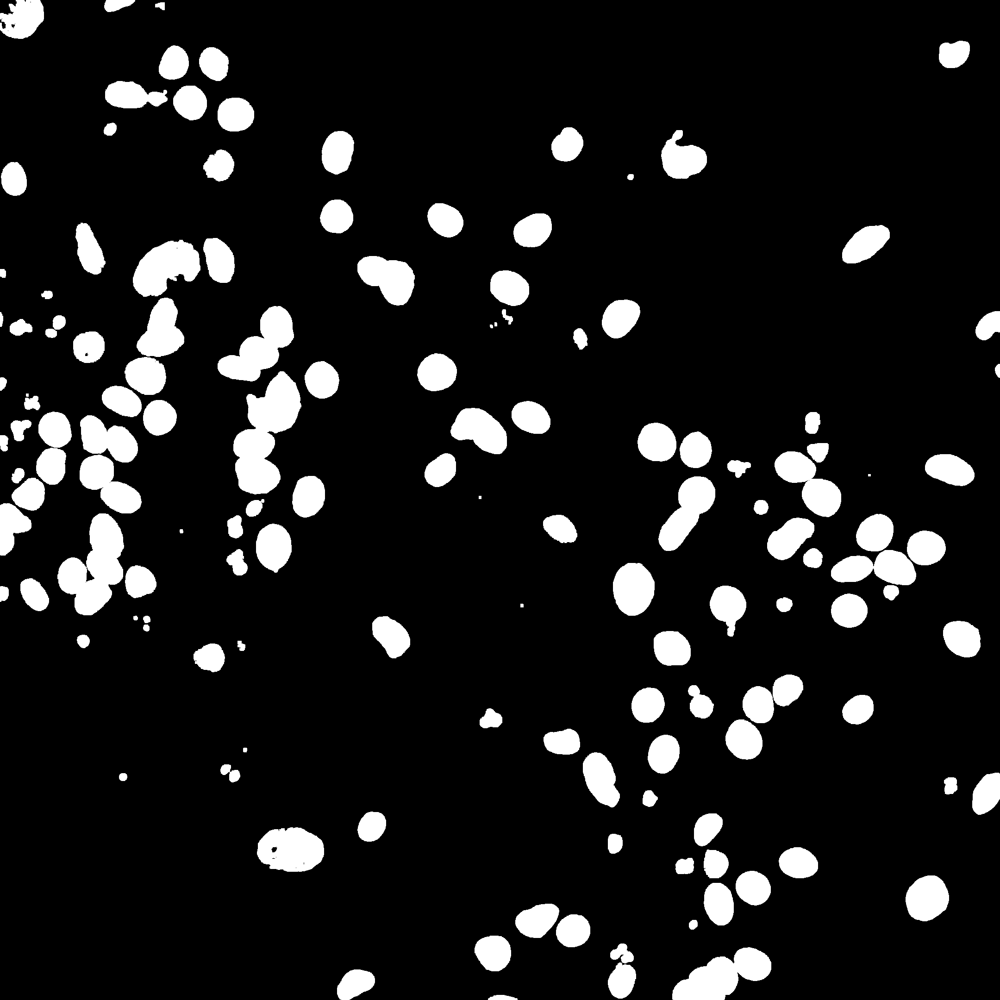
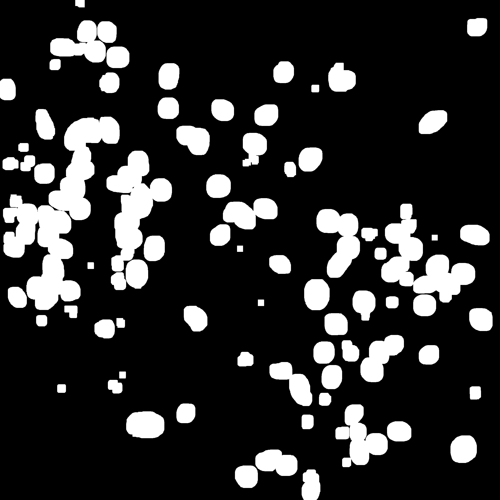
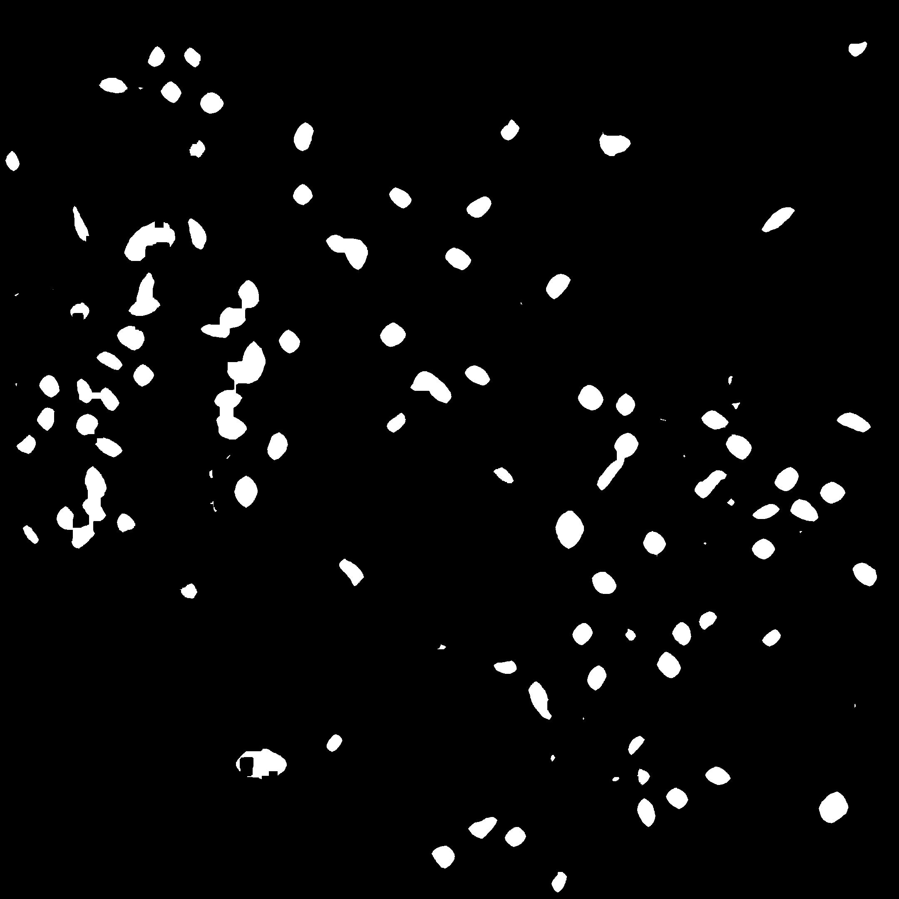
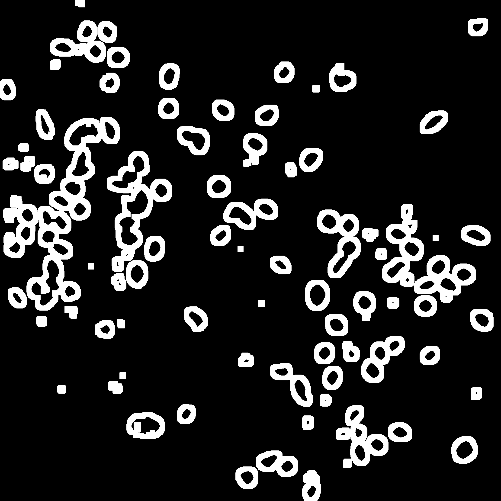
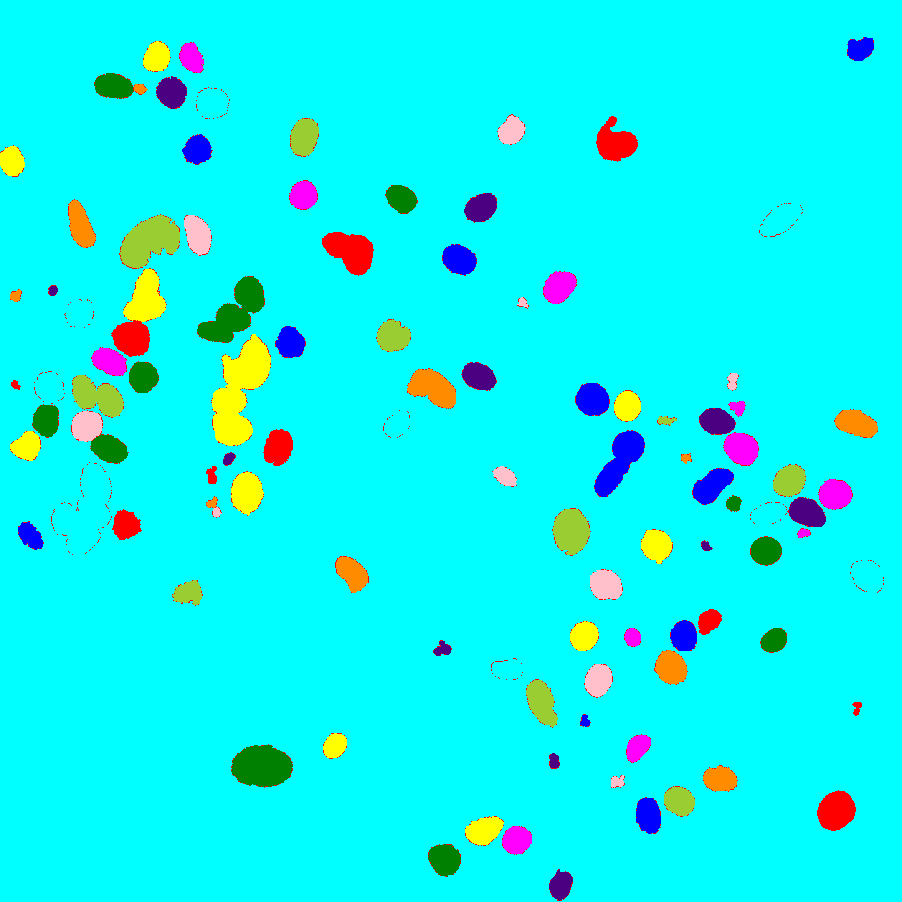

# Image Segmentation For Nuclei Count
# Cell Counting in Microscope Images

This project implements an automated cell counting system for confocal microscope images of neuronal cell samples. It uses various image processing techniques to identify and count individual cells. Key features include:

1. Image preprocessing: Thresholding, morphological operations, and border clearing
2. Cell segmentation: Distance transform and watershed algorithm
3. Feature extraction: Measures properties like area, diameter, and intensity of identified cells
4. Data analysis: Converts pixel measurements to micrometers and exports results to CSV

The script uses libraries such as OpenCV, NumPy, scikit-image, and pandas for image processing and data manipulation. It processes DAPI-stained images, focusing on the blue channel for nuclei detection.

This tool automates a crucial step in biological and medical research, providing quantitative data on cell populations in microscope images.

## Gallery:

<table>
  <tr>
     <td>Opening</td>
     <td>Dilation</td>
     <td>Erosion</td>
  </tr>
  <tr>
    <td></td>
    <td></td>
    <td></td>
  </tr>
  <tr>
    <td>Unknow Regions</td>
     <td>Watershed</td>
     <td>Final Result</td>
  </tr>
  <tr>
    <td></td>
    <td></td>
    <td></td>
  </tr>
 </table>

