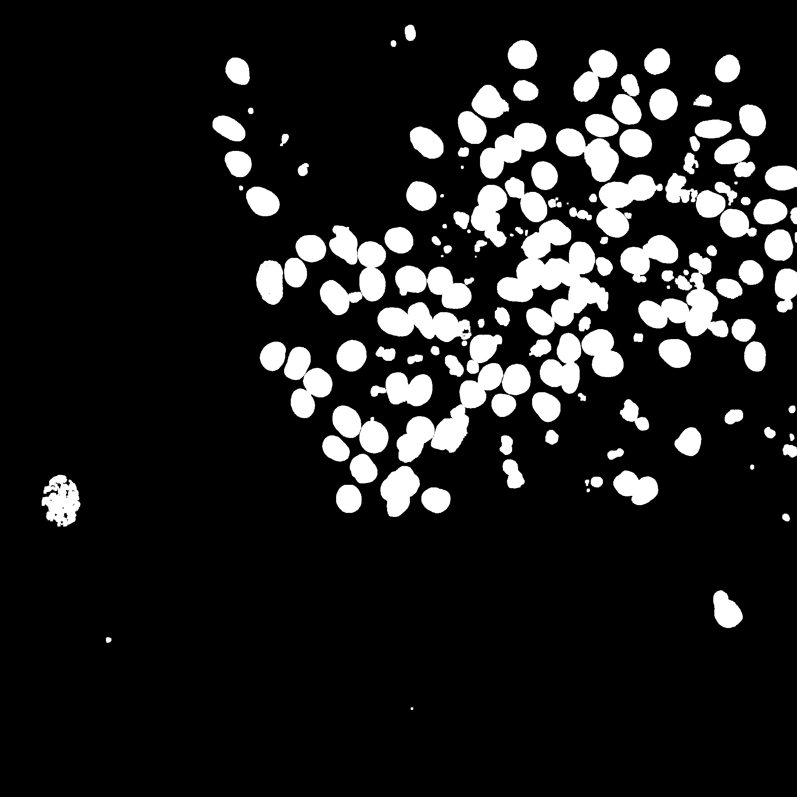

# Image Segmentation For Nuclei Count
Progetto per l'esame di Sistemi Multimediali.

Nel seguente elaborato, verrà analizzato un sistema per la conta delle cellule presenti in un'immagine di un campione prodotta da un microscopio confocale. Il processo della conta delle cellule è alla base di numerosi esperimenti in ambito biologico o medico, le immagini analizzate sono state prese da campioni di cellule neuronali.

## Gallery:

  
  
  
  
 <a style='text-decoration: none; color: gray;'>
  <imgsrc="assets/dapi/risultati/13.png" style='width: 300'>
  
I just love to visit this most beautiful place in all the world.

</a>
  

  

